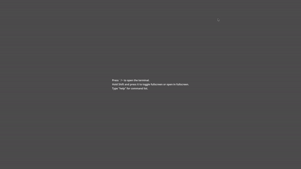

# Gosole
Gosole is an developer console addon for Godot Engine 4 written in GDScript that allows you to add custom commands.



*This is from before it renamed to Gosole cuz' i'm too lazy to change.*

## Usage
To add command, type:
```gdscript
Console.register_cmd("example",example,"Example command")
```
You can also specify up to 3 params:
```gdscript
Console.register_cmd("teleport",teleport,"Teleport to specified position or entity",3)
```

or an help parameters:
```gdscript
Console.register_cmd("heal",heal,"Heal the player by <amount>",1,"<amount>")
```

To remove:
```gdscript
Console.unregister_cmd("example")
```

## Features
- Command execution with ability to create custom commands with description, parameter(s), help parameter(s), and flag(s).
- Aliases.
- Basic command history.
- Log to view printed lines.
- Scrollback.
- Command/alias list with description, flags, etc. if specified.

Some parts of the code has been taken from [jitspoe's godot-console](https://github.com/jitspoe/godot-console).

## Differences from jitspoe's console
- Rewritten and refactored.
- Different look from Quake III: Arena.
- Doesn't automatically create GUI elements in script.
- Uses custom input instead of LineEdit.
- Slide animation when opening, toggling fullscreen, or closing.
- Ability to create aliases.
- *No autocompletion?*

## Known Issues

- Alias with another alias may cause errors if **command_list** was used, likely due to the limitation of GDScript.

## Third-party assets

Inconsolata for console font licensed under OFL (Open Font License).
